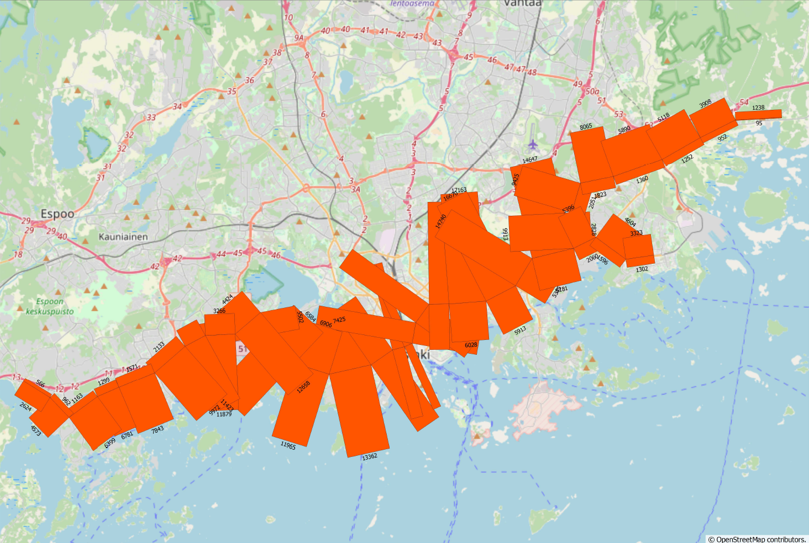
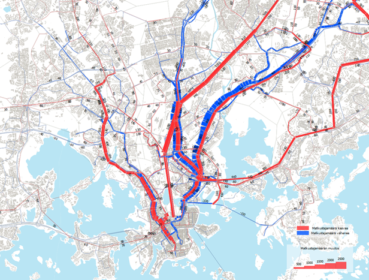
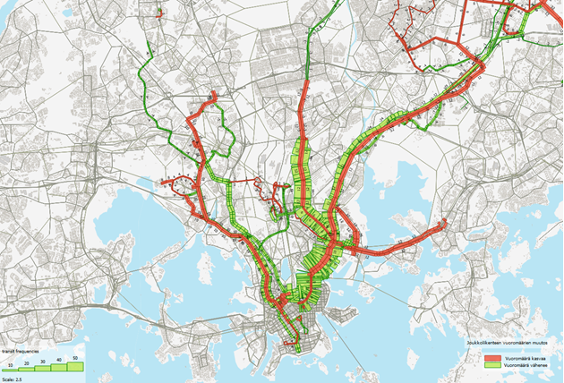
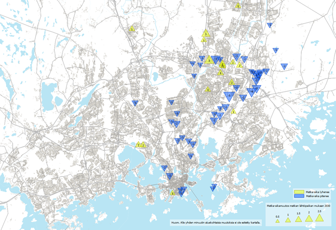
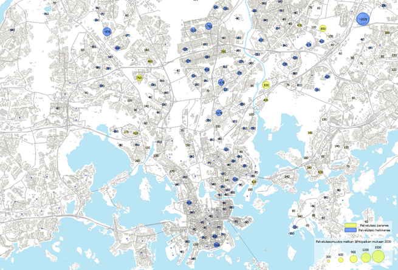
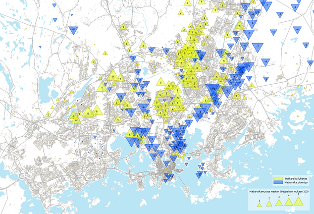

# Esimerkkejä Helmet-mallilla tuotettavista tuloksista

Mallin avulla saadaan tietoa suunnitteluratkaisuihin ja valintoihin jo suunnitteluprosessin aikana, ja sen avulla arvioidaan suunnittelun vaikutuksia ”etukäteen”. Malli tuo esiin esimerkiksi kulkumuotojakauman, matka-ajan, saavutettavuuden, matkamääriä ja liikennesuoritteita. 

Tässä on kuvattu muutamia esimerkkejä erilaisista visualisoinneista, joita malliaineistoista voidaan tehdä. Vastaavia visualisointeja voidaan tuottaa myös muista kulkumuodoista.

**Metron kuormitus**

**Joukkoliikenteen matkustajamäärän muutos**

**Joukkoliikenteen vuoromäärän muutos**

**Joukkoliikenteen matka-ajan muutos**

**Joukkoliikenteen palvelutasomuutos**

**Keskustan saavutettavuusmuutos joukkoliikenteellä**

