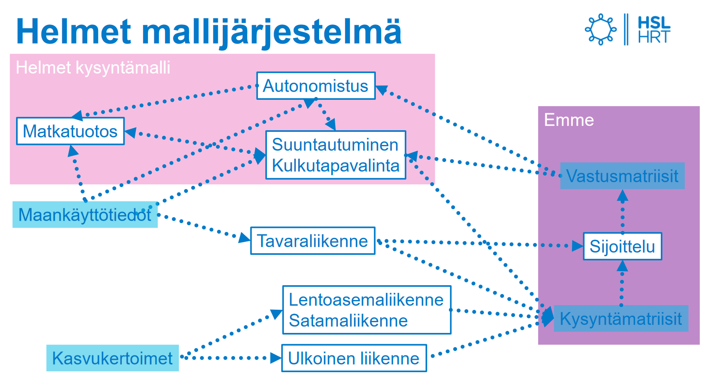

# HSL:n liikenne-ennustemallin yleiskuvaus

Helmet on HSL:n oma liikenne-ennustejärjestelmä, joka kattaa Helsingin seudun 14 kuntaa ja Siuntion sekä niitä ympäröivän työssäkäyntialueen. Ennustemallin ylläpidosta vastaa Liikennejärjestelmäryhmä (Jens West), ja liikenneverkkokuvausten ylläpidosta vastaa Joukkoliikennejärjestelmät-ryhmä (Mervi Vatanen). Uusin malliversio Helmet 4 julkaistiin lokakuussa 2020. Järjestelmä käyttää Inro:n Emme-ohjelmistoa.

HSL:n Helmet-liikenne-ennustemallia voidaan käyttää arvioimaan erilaisten muutostekijöiden vaikutuksia liikennejärjestelmään. Mallia hyödynnetään ja kehitetään erityisesti palvelemaan seudullisen MAL-suunnitelman vaikutusten arviontia. HSL ja muut tahot käyttävät Helmet-mallia myös monissa muissa töissä, kuten linjastosuunnitelmien vaikutusten arvioinnissa sekä liikennehankkeiden hankearvioinneissa.

Mallin avulla saadaan tietoa suunnitteluratkaisuihin ja valintoihin jo suunnitteluprosessin aikana, ja sen avulla arvioidaan suunnittelun vaikutuksia ”etukäteen”. Malli tuo esiin esimerkiksi kulkumuotojakauman, matka-ajan, saavutettavuuden, matkamääriä ja liikennesuoritteita. Lisätietoa ja esimerkkejä mallilla tuotettavista tarkasteluista [täällä](esimerkkeja_tuloksista.md).

## Mallintamisen taustoja

### Termejä

* **Malli:** Matemaattinen kuvaus järjestelmästä (tässä tapauksessa Helsingin seudun liikkumisesta)
* **Mallin estimointi:** Mallin parametrien määritys niin, että malli kuvaa käytetyillä lähtötiedoilla mahdollisimman hyvin lähtöaineistossa (nykytila) havaittua käyttäytymistä 
* **Mallin validointi:** Testaus, että malli tosiaan ennakoi nykytilalle oikean tuloksen
* **Ennuste:** Mallin käyttö _samoilla parametreilla_, mutta _eri lähtötiedoilla_ kuin estimoinnissa

### Mallin oletuksia, perusteluita ja rajoituksia

Oletuksena yksilöiden hyödyn maksimointi:
* Malli olettaa, että ihmiset ovat tietoisia kaikista vaihtoehdoista ja niiden hyödyistä ja haitoista
* Malli tekee ainoastaan ihmisten oman hyödyn maksimoivia valintoja
* Todellisuudessa ihmisten päätöksenteko ei ole näin suoraviivaista ja rationaalista, mutta hyötymaksimointi on mallintamisessa yleisesti käytetty oletus

Malli perustuu nykytilan havaintoaineiston valintoihin:
* Oletetaan, että ennustevuoden ihmiset tekevät valintansa samalla perusteella kuin havaintoaineistossa eli nykytilassa
* Ennusteita ei voida tehdä asenteiden muutoksista (jos matka-aikaa, kustannuksia ym. arvostetaan eri tavalla kuin nykyisin)

Mallin matemaattinen pohja perustuu diskreetteihin valintamalleihin:
* Mallijärjestelmä rakentuu useista eri osamalleista, joissa kuvataan logit-malleilla todennäköisyyttä, että päätöksentekijä valitsee tietyn vaihtoehdon (esim. kulkutapa)
* Teoriapohjaksi ks. esim. Kenneth Trainin e-kirja Discrete Choice Methods with Simulation, ensimmäinen osa luvusta 2 (Properties of Discrete Choice Models), s. 11-23: (https://eml.berkeley.edu/books/choice2.html))

Tyypillisesti liikennemallit jakautuvat neljään osaan, jotka on kytketty toisiinsa:
* _Matkatuotos_ eli matkojen määrät lähtö- ja määräpaikoittain
* _Suuntautuminen_ eli lähtö- ja määräpaikkojen yhdistelmät
* _Kulkutavan valinta_ eli matkojen jako mm. henkilöauton, joukkoliikenteen ja pyöräilyn kesken
* _Sijoittelu_ eli reittien valinta

## HSL:n Helmet-malli

### Mallin lähtötiedot

Lähtötietojen määrittäminen on jo itsessään ennustamista. HSL ylläpitää lähtötietoaineistoja MAL-suunnittelun ja joukkoliikennesuunnittelun tueksi. Lisätietoja HSL:n tarjoamista aineistoista [täällä](HSL_lahtotiedot.md).

Helmet-mallin lähtötiedoiksi tarvitaan seuraavat tiedot:

**Alueiden maankäyttöä koskevat tiedot:**
* Asukkaiden kokonaismäärät ja ikäryhmien osuudet
* Työpaikkojen kokonaismäärät
* Kaupan työpaikkojen osuus kaikista työpaikoista 
* Palvelutyöpaikkojen osuus kaikista työpaikoista 
* Teollisuustyöpaikkojen osuus kaikista työpaikoista 
* Logistiikan työpaikkojen osuus kaikista työpaikoista 
* 1., 2. ja 3. asteen oppilaspaikkamäärät
* Kerros- ja pientalojen osuudet

**Liikennejärjestelmää koskevat tiedot:**
* Henkilöauton kilometrikustannus (polttoaine, renkaat)
* Joukkoliikenteen vyöhykehinnat
* Tie-ja katuverkon ominaisuudet (linkin tieluokka, kaistamäärä, pituus)
* Joukkoliikennelinjasto (tunnus, reitti, keskimääräinen vuoroväli)
* Erillisillä malleilla laskettu tavaraliikenne sekä satamien ja lentoaseman henkilöliikenne
* Työmatkojen pysäköintimaksu alueittain
* Asiointimatkojen pysäköintimaksut alueittain

### Lähtötietojen vaikutus ennustemallin eri osiin

* Autonomistus alueittain
  * Kerros- ja pientalojen osuudet
  * Matka-aikasuhteet
* Matkamäärä alueittain
  * Asukasmäärä ikäryhmittäin
  * Autonomistus
* Kulkutavan valinta
  * Alueparien väliset matka-ajat autolla ja joukkoliikenteellä
  * Alueparien väliset etäisyydet polkupyörällä ja autolla
  * Alueparien väliset matkakustannukset: joukkoliikennelipun hinta, autoiun muuttuvat kustannukset (polttoaine, renkaat) ja mahdollinen ruuhkamaksu/tietulli
  * Autonomistus alueittain
* Matkakohteiden valinta
  * Saavutettavuus (matka-aika, etäiyys ja matkakustannus määräpaikkaan eri kulkutavoilla)
  * Työpaikkamäärä määräpaikassa
  * Oppilaspaikkojen määrä määräpaikassa
* Reitin valinta
  * Auto- ja joukkoliikennelinkin matka-aika
  * Pyörälinkin pituus
  * Autolinkin matkakustannus 

### Mallijärjestelmän rakenne

Helmet 4 -mallijärjestelmässä mallin neljä porrasta ennustetaan seuraavassa järjestyksessä:
1. Matkatuotos
2. Kulkutavanvalinta
3. Suuntautuminen
4. Sijoittelu

Mallijärjestelmän rakenne on esitetty tarkemmin seuraavassa kuvassa: 

Mallijärjestelmän kysyntämalleja kuvataan tarkemmin raportissa [Helsingin seudun työssäkäyntialueen liikenne-ennustejärjestelmän kysyntämallit 2020](https://hslfi.azureedge.net/globalassets/julkaisuarkisto/2020/6_2020_helsingin_seudun_tyossakayntialueen_liikenne-ennustejarjestelman_kysyntamallit.pdf).

Mallijärjestelmän tarjontakuvauksista lisätietoa on raportissa Helsingin seudun liikenteen Emme-verkon kuvaus, joka on saatavilla mallin käyttäjien EXT-Helmet -Teams-ryhmässä.

### Helmet 4 uusia ominaisuuksia

Tässä on kuvattu keskeisiä nostoja Helmet 4:n uusista ominaisuuksista sekä eroavaisuuksista Helmet 3:een verrattuna. Laajemmin aihetta on kuvattu [malliraportissa](https://hslfi.azureedge.net/globalassets/julkaisuarkisto/2020/6_2020_helsingin_seudun_tyossakayntialueen_liikenne-ennustejarjestelman_kysyntamallit.pdf). 

**Kulkutapa- ja suuntautumismallien rakenne**

Helmet-mallien aiempiin versioihin verrattuna kulkutapa- ja suuntautumismallien rakenne on HS15-alueella käännetty siten, että kulkutavanvalinta on nyt ylemmällä tasolla kuin määräpaikan valinta (eli suuntautuminen).

**Aluejako**

Helmet 4 -malleissa käytetään vain yhtä aluejakoa, eli mallissa ei enää ole erillisiä ennuste- ja sijoittelualueita tai näiden välisiä jakolukuja. Ennustealuejaon tihentyminen kasvattaa jonkin verran mallin ajon vaatimaa aikaa.

**Kiertomatkat**

Helmet 4 -ennustejärjestelmässä kysyntä ei perustu enää matkoihin, vaan kiertomatkoihin, johon meno- ja paluumatkojen - esimerkiksi kotoa töihin tai kouluun ja takaisin - lisäksi voi kuulua toissijainen määräpaikka - esimerkiksi työmatkaan liittyvä kauppa- tai asiointimatka.  

**Agenttisimuloinnin kehittäminen**

Uudessa ennustejärjestelmässä on mahdollisuus ajaa perinteisen malliajon lisäksi niin sanottuja agenttisimulointeja, joissa voidaan seurata yksilöiden matkustamista vuorokauden aikana. Tällä tavalla voidaan tutkia miten erilaiset toimenpiteet vaikuttavat eri väestöryhmiin. Tätä mahdollisuutta kehitetään edelleen talven 2020-2021 aikana MAL-suunnittelun vaikutusten arvioinnin kehittämisen yhteydessä. 

**Joukkoliikenteen ruuhkautuvuus**

Aikaisemmissa malliversioissa ruuhkautuminen aiheutti ongelmia:
* Jotkut linjat ylikuormittuivat epärealistisesti
* Hankearvioinnit eivät ole ottaneet huomioon kapasiteettilisäysten vaikutuksia matkan mukavuuteen ja toteutettavuuteen

Jatkossa Helmet 4 myötä kuormitusaste vaikuttaa reitinvalintoihin, ja reitin vastus kasvaa kun linjan kuormitusaste kasvaa.

**Pyöräilyn mallinnus**

* Pyöräilylinkit (yhteydet) on tarkistettu
* Verkolle on lisätty tieto pyörätien karkeasta laatuluokasta:
  * Baana
  * Erillinen pyörätie
  * Pyörätie kadun varressa
  * Pyöräkaista
  * Sekaliikenne (oletus)
* Pyöräilyn yhteydet vaikuttavat reitinvalintoihin

**Tulokset verrattuna Helmet 3.1:een**

Autoliikenteen liikennemäärät ovat pääväylillä hieman pienempiä kuin Helmet 3.1 versiossa ja vastaavasti poikittaisessa liikenteessä kehäteillä on enemmän kuormitusta. Uudet liikennemäärät vastaavat hieman paremmin laskentatietoja, mutta molemmissa malliversiossa vastaavuus on hyvällä tasolla.

Joukkoliikennekulkutapojen väliset painosuhteet muuttuvat siten, että uusi malliversio ennustaa enemmän juna- ja raitiotiematkoja, mikä on todennäköisesti seurausta joukkoliikenteen ruuhkasijoittelun käyttöönotosta malliversioiden välillä. Muutos on juna- ja raitioliikenteessä oikeansuuntainen suhteessa laskentatietoihin.

Muutoksiin reagoimisen osalta malli toimii vähemmän herkästi suhteessa Helmet 3.1 -malliin. Erityisenä huomiona muutoksien osalta aiemman malliversion jalankulkumalli reagoi hyvin voimakkaasti pysäköintimaksujen nostoon, koska kustannus oli mallissa mukana suorana matkojen määrää ennustavana muuttujana ja kulkutavan valinta ei ollut liitoksissa muiden kulkutapojen valintaan ja olosuhteiden kehitykseen.

### Helmet 4 -tuloksiin liittyviä epävarmuuksia

Mallia laadittaessa sen antamia tuloksia on verrattu monipuolisesti erilaiseen havaintoaineistoon ja pyritty saamaan tulokset vastaamaan mahdollisimman hyvin havaintoja. Tuloksiin liittyy silti tiettyjä epävarmuuksia ja rajoitteita, joista on nostettu tähän keskeisimpiä havaintoja. Mallin testausta ja testien tuloksia on kuvattu laajemmin raportissa [Helsingin seudun työssäkäyntialueen liikenne-ennustejärjestelmän kysyntämallit 2020](https://hslfi.azureedge.net/globalassets/julkaisuarkisto/2020/6_2020_helsingin_seudun_tyossakayntialueen_liikenne-ennustejarjestelman_kysyntamallit.pdf) (luvut 12 ja 13).

Nykytilanteen osalta malli toimii hyvin, eikä kysynnän ennustamiseen liittyviä systemaattisia virheitä testauksessa havaittu. Malli tuottaa suuntautumisen, autoliikennemäärien ja pyöräliikennemäärien osalta ulkopuolisia havaintoja vastaavia nykytilanteen ennusteita. Mallin tulokset eivät poikkea nykytilanteen osalta merkittävästi Helmet 3.1-versiosta.

Joukkoliikenteen osalta havaittiin kuitenkin ongelma, joka on syytä huomioida hanketarkasteluissa. Vuorokauden matkustajamääräarviot on aliarvioitu runkoyhteyksillä metrolla, junalla ja raitiovaunuilla, kun taas bussien matkustajamäärät on hieman yliarvioitu. Huipputuntien osalta nykyennuste vastaa laskentoja hyvin, joten ongelma on todennäköisesti vuorokausilaajennuskertoimissa, jotka eivät nykyisellään huomioi runkoyhteyksien ja muiden yhteyksien erilaisia liikennöintiaikoja.

Helmet 4 -mallin avulla tehtäviä H/K-laskelmia kannattanee hyödyntää vain suurille liikennejärjestelmätason hankkeille.

## Tietopyynnöt

Liikenne-ennusteisiin ja näiden tuloksiin liittyvä tietopyynnöt kannattaa osoittaa Jens Westille ja Mervi Vataselle. Pääsääntöisesti tietopyyntöihin pyritään vastaamaan MAL-työn virallisilla ennusteilla, mutta tapauskohtaisesti voidaan toimittaa myös muuta aineistoa. 

HSL:n tarjoamista lähtötiedoista lisätietoa [täällä](HSL_lahtotiedot.md).

## Mallin käyttöohjeet

Lisätietoa mallin käyttämisestä löydät [täältä](mallitoiden_yleisohje.md).

## Mallitöiden tilaajan ohjeet

Lisätietoa etenkin HSL:n teettämien mallitöiden tilaamisesta löydät [täältä](HSL-mallitoiden_tilaajan_ohje.md).

